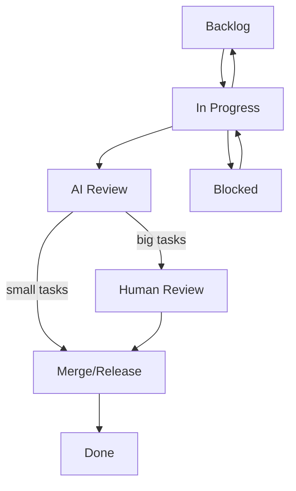

# Kanban Synchronization Protocol - Part 2: Label Transitions and Board Commands

This document contains the valid label transitions and project board synchronization commands.

**Parent document:** [KANBAN_SYNC_PROTOCOL.md](./KANBAN_SYNC_PROTOCOL.md)

---

## Label Transitions

### Valid Transitions



### Transition Commands

#### Backlog → In Progress
```bash
gh issue edit {{ISSUE_NUMBER}} \
  --repo {{GITHUB_OWNER}}/{{REPO_NAME}} \
  --remove-label "status:backlog" \
  --add-label "status:in-progress"
```

#### In Progress → AI Review
```bash
gh issue edit {{ISSUE_NUMBER}} \
  --repo {{GITHUB_OWNER}}/{{REPO_NAME}} \
  --remove-label "status:in-progress" \
  --add-label "status:ai-review"
```

#### AI Review → Human Review (big tasks requiring human approval)
```bash
gh issue edit {{ISSUE_NUMBER}} \
  --repo {{GITHUB_OWNER}}/{{REPO_NAME}} \
  --remove-label "status:ai-review" \
  --add-label "status:human-review"
```

#### AI Review → Merge/Release (small tasks that pass AI review)
```bash
gh issue edit {{ISSUE_NUMBER}} \
  --repo {{GITHUB_OWNER}}/{{REPO_NAME}} \
  --remove-label "status:ai-review" \
  --add-label "status:merge-release"
```

#### Human Review → Merge/Release (human-approved tasks)
```bash
gh issue edit {{ISSUE_NUMBER}} \
  --repo {{GITHUB_OWNER}}/{{REPO_NAME}} \
  --remove-label "status:human-review" \
  --add-label "status:merge-release"
```

#### Human Review → In Progress (changes requested by human reviewer)
```bash
gh issue edit {{ISSUE_NUMBER}} \
  --repo {{GITHUB_OWNER}}/{{REPO_NAME}} \
  --remove-label "status:human-review" \
  --add-label "status:in-progress"
```

#### AI Review → In Progress (changes requested by AI reviewer)
```bash
gh issue edit {{ISSUE_NUMBER}} \
  --repo {{GITHUB_OWNER}}/{{REPO_NAME}} \
  --remove-label "status:ai-review" \
  --add-label "status:in-progress"
```

#### Merge/Release → Done
```bash
gh issue edit {{ISSUE_NUMBER}} \
  --repo {{GITHUB_OWNER}}/{{REPO_NAME}} \
  --remove-label "status:merge-release" \
  --add-label "status:done"
```

#### In Progress → Blocked
```bash
gh issue edit {{ISSUE_NUMBER}} \
  --repo {{GITHUB_OWNER}}/{{REPO_NAME}} \
  --remove-label "status:in-progress" \
  --add-label "status:blocked"
```

#### Blocked → In Progress
```bash
gh issue edit {{ISSUE_NUMBER}} \
  --repo {{GITHUB_OWNER}}/{{REPO_NAME}} \
  --remove-label "status:blocked" \
  --add-label "status:in-progress"
```

#### In Progress → Backlog (de-assignment)
```bash
gh issue edit {{ISSUE_NUMBER}} \
  --repo {{GITHUB_OWNER}}/{{REPO_NAME}} \
  --remove-label "status:in-progress" \
  --add-label "status:backlog" \
  --remove-assignee "{{AGENT_ASSIGNEE}}"
```

---

## Project Board Sync Commands

### Get Item ID for Issue

```bash
# Get project item ID from issue number
gh project item-list {{PROJECT_NUMBER}} \
  --owner {{GITHUB_OWNER}} \
  --format json | \
  jq -r ".items[] | select(.content.number == {{ISSUE_NUMBER}}) | .id"
```

### Update Status Field

```bash
# Get status field ID
STATUS_FIELD_ID=$(gh project field-list {{PROJECT_NUMBER}} \
  --owner {{GITHUB_OWNER}} \
  --format json | \
  jq -r '.[] | select(.name == "Status") | .id')

# Update item status
gh project item-edit \
  --project-id {{PROJECT_ID}} \
  --id {{ITEM_ID}} \
  --field-id "$STATUS_FIELD_ID" \
  --value "{{NEW_STATUS}}"
```

### Update Platform Field

```bash
# Get platform field ID
PLATFORM_FIELD_ID=$(gh project field-list {{PROJECT_NUMBER}} \
  --owner {{GITHUB_OWNER}} \
  --format json | \
  jq -r '.[] | select(.name == "Platform") | .id')

# Update item platform
gh project item-edit \
  --project-id {{PROJECT_ID}} \
  --id {{ITEM_ID}} \
  --field-id "$PLATFORM_FIELD_ID" \
  --value "{{PLATFORM}}"
```

### Update Priority Field

```bash
# Get priority field ID
PRIORITY_FIELD_ID=$(gh project field-list {{PROJECT_NUMBER}} \
  --owner {{GITHUB_OWNER}} \
  --format json | \
  jq -r '.[] | select(.name == "Priority") | .id')

# Update item priority
gh project item-edit \
  --project-id {{PROJECT_ID}} \
  --id {{ITEM_ID}} \
  --field-id "$PRIORITY_FIELD_ID" \
  --value "{{PRIORITY}}"
```

### Update Agent Field

```bash
# Get agent field ID
AGENT_FIELD_ID=$(gh project field-list {{PROJECT_NUMBER}} \
  --owner {{GITHUB_OWNER}} \
  --format json | \
  jq -r '.[] | select(.name == "Agent") | .id')

# Update item agent
gh project item-edit \
  --project-id {{PROJECT_ID}} \
  --id {{ITEM_ID}} \
  --field-id "$AGENT_FIELD_ID" \
  --text "{{AGENT_NAME}}"
```
