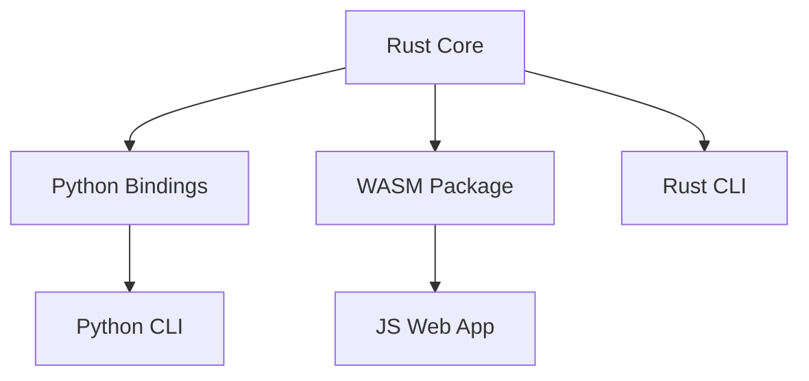

# Monorepo Toolchain Composition - Part 3: Integration Patterns

This part covers cross-language integration patterns and dependency management in multi-language monorepos.

---

## Dependency Graph for Build Order

### Example: XLS Platform



**Build Order:**
1. Rust Core (no dependencies)
2. Python Bindings (depends on Rust)
3. WASM Package (depends on Rust)
4. Python CLI (depends on Python Bindings)
5. JS Web App (depends on WASM Package)
6. Rust CLI (depends on Rust Core)

**Parallel Build Groups:**
- Group 1: Rust Core
- Group 2: Python Bindings, WASM Package, Rust CLI (parallel)
- Group 3: Python CLI, JS Web App (parallel)

---

## Cross-Language Integration Patterns

### Pattern 1: Rust Core with Python Bindings (PyO3)

```rust
// {{RUST_WORKSPACE}}/packages/python-bindings/src/lib.rs
use pyo3::prelude::*;

#[pyfunction]
fn process_xls(path: String) -> PyResult<String> {
    // Call Rust core library
    let result = xls_core::process(&path)
        .map_err(|e| PyErr::new::<pyo3::exceptions::PyRuntimeError, _>(e.to_string()))?;
    Ok(result)
}

#[pymodule]
fn xls_bindings(_py: Python, m: &PyModule) -> PyResult<()> {
    m.add_function(wrap_pyfunction!(process_xls, m)?)?;
    Ok(())
}
```

```toml
# Cargo.toml for Python bindings package
[lib]
name = "xls_bindings"
crate-type = ["cdylib"]

[dependencies]
pyo3 = { workspace = true }
xls-core = { path = "../core" }
```

### Pattern 2: Rust Core with WASM for Web (wasm-bindgen)

```rust
// {{RUST_WORKSPACE}}/packages/wasm-bindings/src/lib.rs
use wasm_bindgen::prelude::*;

#[wasm_bindgen]
pub fn process_xls(data: &[u8]) -> Result<String, JsValue> {
    xls_core::process_bytes(data)
        .map_err(|e| JsValue::from_str(&e.to_string()))
}
```

```json
// {{JS_WORKSPACE}}/packages/xls-wasm/package.json
{
  "name": "@xls-platform/wasm",
  "scripts": {
    "build": "wasm-pack build --target web ../../rust-workspace/packages/wasm-bindings"
  }
}
```

### Pattern 3: Shared Configuration Files

All languages reference the same configuration directory:

```
{{SHARED_CONFIG_DIR}}/
├── rustfmt.toml       (used by Rust)
├── eslint.config.js   (used by JS/TS)
├── ruff.toml          (used by Python)
└── prettier.config.js (used by JS/TS, Markdown)
```

Each workspace extends the shared config:

```toml
# {{RUST_WORKSPACE}}/rustfmt.toml
extend = "../{{SHARED_CONFIG_DIR}}/rustfmt.toml"
```

---

## Per-Language vs Shared Tooling

### Shared Tools (Root Level)

Install once, use everywhere:
- Git
- Pre-commit hooks
- EditorConfig
- Prettier (for Markdown, JSON, YAML)

### Per-Language Tools (Workspace Level)

Each workspace manages its own:
- Language runtime (Rust, Node, Python)
- Package manager (Cargo, pnpm, uv)
- Linter (Clippy, ESLint, Ruff)
- Formatter (rustfmt, Prettier, Ruff)
- Type checker (TypeScript, mypy)
- Test runner (cargo test, Vitest, pytest)

---

**Navigation:**
- [Back to Index](./MONOREPO_TOOLCHAIN_COMPOSITION.md)
- [Previous: Part 2 - Verification Scripts](./MONOREPO_TOOLCHAIN_COMPOSITION-part2-verification-scripts.md)
- [Next: Part 4 - Best Practices](./MONOREPO_TOOLCHAIN_COMPOSITION-part4-best-practices.md)
